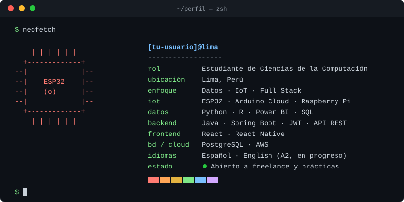
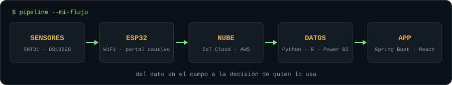

<!-- BANNER ANIMADO (se genera con scripts/banner/generate.py) -->
<a href="https://github.com/marco-sg10">
  <picture>
    <source media="(prefers-color-scheme: dark)" srcset="assets/banner-dark.svg">
    <source media="(prefers-color-scheme: light)" srcset="assets/banner-light.svg">
    
  </picture>
</a>

 

---

## `$ whoami`

  

Soy Marco Sabino estudiante de Ciencias de la Computación, apasionado por la tecnología desde pequeño y ahora a un nivel más profesional. Me interesa resolver problemas reales con datos y software.
Un poco de mi:
- Diseñé un sistema IoT que se probó en campo con una cooperativa cacaotera en la selva peruana.
- Convierto datos de Excel, SQL y sensores en dashboards y modelos de predicción.
- Proceso datos espaciales con **QGIS** y los convierto en mapas interactivos de ciudades con variables como el transito, contaminación ambiental, ruido, actividad humana a partir de data geoespacial.
- Construyo **sistemas web multiplataforma** (laptop, tablet y celular): servidor con **Spring Boot, Java** y cliente con **Java Scrip,TypeScript, React, React native y Tailwind CSS**.
- Trabajo con **Docker, GitHub Actions y CI/CD**.
- Uso **Linux** a diario, he instalado distintas distribuciones en equipos antiguos y usé una Raspberry Pi como computador de escritorio.
- Manejo de inglés con certificado de TOELF ITP.

---

## `$ pipeline --mi-flujo`

  

---

## `$ ls proyectos/`

| Proyecto | Qué resuelve | Tecnologías |
|---|---|---|
| **[Monitoreo IoT de fermentación de cacao](https://github.com/marco-sg10/cacao-fermentation-iot)** | Registra temperatura ambiente e interior y humedad relativa durante la fermentación y avisa con un sistema de alarma a nivel dashboard y dentro de la arquitectura del sistema cuando salen del rango óptimo. Probado en Tocache con productores. | ESP32 · SHT31 · DS18B20 · Arduino IoT Cloud · C++ . Arduino|
| **[Lima Pulso: ¿cómo respira Lima?](https://github.com/marco-sg10/lima-pulso)** | Tomo capas espaciales de fuentes confiables, las recorto a Lima en QGIS, las unifico en una sola base y las muestro en un mapa interactivo por distrito: ruido, tráfico, actividad humana y contaminación según la hora del día. | QGIS Desktop · Excel · HTML . JavaScript . CSS |
| **[UrbanFix](https://github.com/marco-sg10/urbanfix)** | Sistema web multiplataforma, que resulve la centralización de reportes de problemas urbanos en las ciudades | Java · Spring Boot · API REST · JWT · Docker Compose · Dockerfile para AWS · JavaScript . TypeScript · React · React Native . Tailwind CSS · Axios |
| **[Predicción de productos más vendidos](https://github.com/marco-sg10/REPO_ML)** | Modelo que aprende de ventas 2020-2026 en Excel para anticipar qué productos se venden más. | Python · pandas · Machine Learning |
| **[Sistema bancario en SQL](https://github.com/marco-sg10/REPO_BANCO)** | Diseño e implementación de la base de datos de un sistema bancario. Proyecto del curso de Bases de Datos, sin interfaz. | SQL · PostgreSQL |
| **[Red neuronal en C++](https://github.com/marco-sg10/REPO_NN)** | Clasificación de patrones, predicción de series, control simple y pruebas de robustez con entradas ruidosas. | C++ · punteros · templates · STL |
| **[Dashboards en R y Power BI](https://github.com/marco-sg10/REPO_DASH)** | Análisis estadístico y visualización de datos de negocio. | R · RStudio · Power BI · Excel |

---

## `$ cat tech-stack.yaml`

<table border="1" cellpadding="14" bgcolor="#17171c">
  <thead>
    <tr>
      <th colspan="2" align="left"><code>marco-sg10:~$ cat tech-stack.yaml</code></th>
    </tr>
  </thead>
  <tbody>
    <tr>
      <td width="50%" valign="top"><code>├─ ◉ iot_hardware:</code>  
         
        <code>ESP32 · Arduino · Raspberry Pi · Arduino IoT Cloud</code>
      </td>
      <td width="50%" valign="top"><code>├─ ⌘ sistemas_linux:</code>  
        
         
        <code>Ubuntu 22.04 · Ubuntu 16 · Linux Mint · Raspberry Pi como PC</code>
      </td>
    </tr>
    <tr>
      <td valign="top"><code>├─ ▣ data_analytics:</code>  
         
        <code>Python · R · Power BI · pandas · NumPy · OpenCV (básico)</code>
      </td>
      <td valign="top"><code>├─ ◈ geospatial_gis:</code>  
         
        <code>QGIS Desktop · análisis geoespacial</code>
      </td>
    </tr>
    <tr>
      <td valign="top"><code>├─ ⚙ backend_apis:</code>  
         
        <code>Java · Spring Boot · API REST · JWT · PostgreSQL</code>
      </td>
      <td valign="top"><code>├─ ✦ frontend_multiplataforma:</code>  
        
         
        <code>TypeScript · JavaScript · React · React Native · Tailwind CSS · Axios</code> 
        <code>sistemas web que funcionan en laptop, tablet y celular</code>
      </td>
    </tr>
    <tr>
      <td valign="top"><code>├─ ⌁ languages_core:</code>  
         
        <code>C++ · Python · Java · SQL · R</code>
      </td>
      <td valign="top"><code>╰─ ☁ devops_cloud:</code>  
         
        <code>Docker · Docker Compose · GitHub Actions · CI/CD · Git · AWS</code>
      </td>
    </tr>
  </tbody>
  <tfoot>
    <tr>
      <td colspan="2"><code>status: aprendiendo&nbsp;&nbsp;·&nbsp;&nbsp;environment: campo + desarrollo</code></td>
    </tr>
  </tfoot>
</table>

---

## `$ radar --autoevaluacion`

  <picture>
    <source media="(prefers-color-scheme: dark)" srcset="assets/radar-dark.svg">
    <source media="(prefers-color-scheme: light)" srcset="assets/radar-light.svg">
    
  </picture>&nbsp;
  <picture>
    <source media="(prefers-color-scheme: dark)" srcset="assets/radar-langs-dark.svg">
    <source media="(prefers-color-scheme: light)" srcset="assets/radar-langs-light.svg">
    
  </picture>

<code>autoevaluación personal · en crecimiento</code>

---

## `$ connect --contacto`

&nbsp;&nbsp;
&nbsp;&nbsp;
&nbsp;&nbsp;

 

Hecho con ☕ y mucha curiosidad

